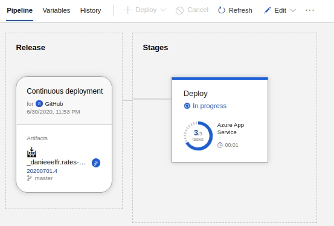

# Tech Challenge - API 2 (consumer-api)

## Solution overview


## DevOps flow


### Continuous integration pipeline


### Continuous delivery pipeline


## Quality assurance
### Coverage report


## Running tests

### Unit and/or Integrated tests
```
dotnet test
```
### With coverage
```
dotnet test \                    
  --configuration Development \
  /p:CollectCoverage=true \
  /p:CoverletOutputFormat=cobertura \
  /p:CoverletOutput=./TestResults/Coverage/
```

```
dotnet tool run reportgenerator \
  -reports:./TestResults/Coverage/coverage.cobertura.xml \
  -targetdir:./CodeCoverage \
  -reporttypes:HtmlInline_AzurePipelines
```
## Dockering
### Build an image
```
docker build --pull --rm -f "Dockerfile" -t consumer-services:latest "."
```
### Running the image in a container
```
docker run --rm -d  -p 5000:5000/tcp -p 5001:5001/tcp consumer-services:latest
```
```
http://localhost:5000/index.html
```
## Deployment

```
just commit the changes
```


## Built With

* .NET Core 3.1
* .NET Tools
* C#
* GitHub
* Jwt
* Microsoft Azure
* Swagger
* Ubuntu 18.3
* Visual Studio Code

## What I've learning?

* Azure - Apps for containers
* Azure DevOps - Continuous integration (CI)
* Azure DevOps - Continuous delivery (CD)
* Azure DevOps - Quality analisys & coverage reports
* Developing .NET applications using Ubuntu and vscode.
* Docker - dockering .NET applications
* Docker - Azure Container Registry
* GitHub actions (not applied)
* Integration tests
* Pact tests (not applied)
* Unit tests
